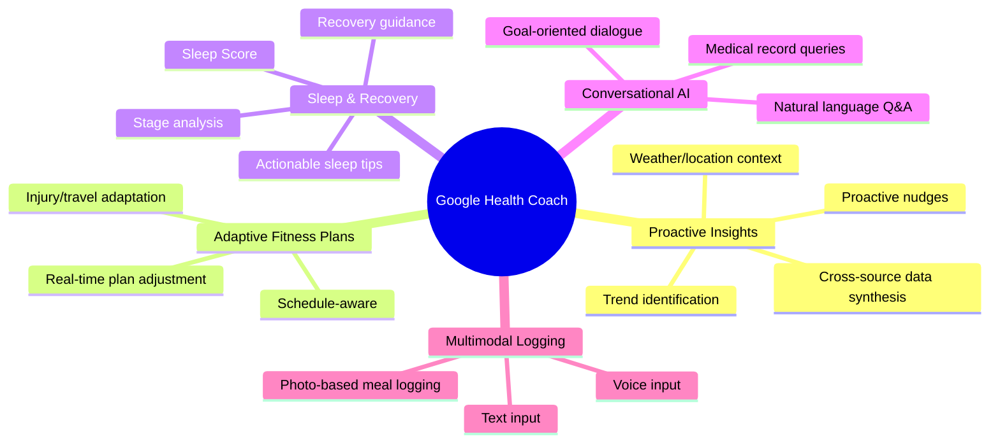
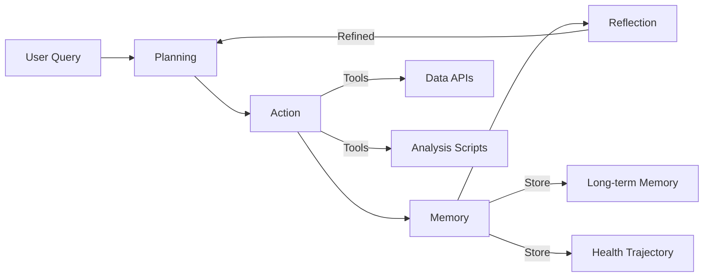
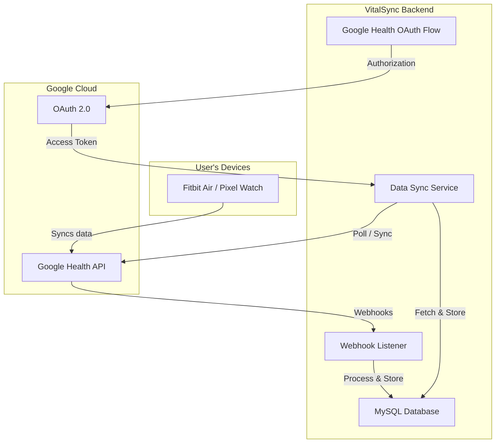
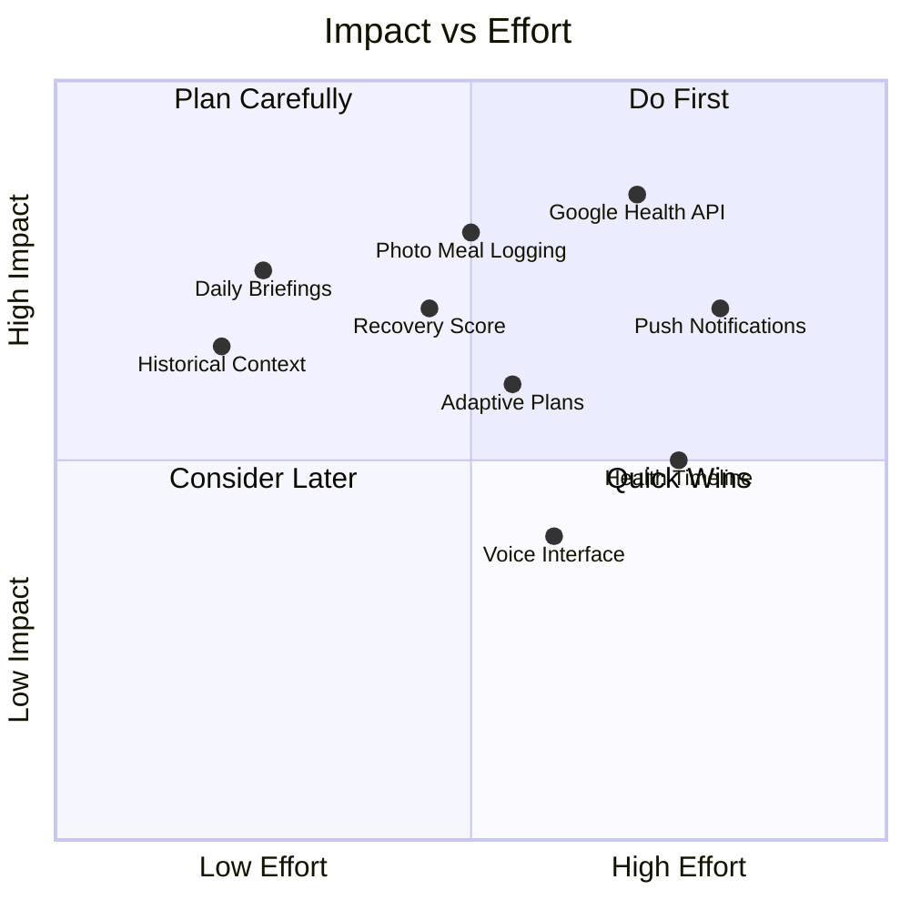

# Research: Google Health Premium AI & VitalSync Integration

> [!NOTE]
> This is a **research-only** document. No implementation changes are being made. The goal is to understand what Google Health Premium offers, how the industry is building health AI agents, and what it would take to bring similar capabilities into VitalSync.

---

## 1. Google Health Premium — What Just Launched (May 19, 2026)

Google rebranded the Fitbit app as **Google Health** today and launched the **Google Health Coach** as the centerpiece of its Premium subscription.

### Subscription Tiers

| Tier | Price | What You Get |
|---|---|---|
| **Free** | $0 | Basic health tracking, steps, sleep stages, heart rate trends, standard dashboard |
| **Premium** | $9.99/mo or $99/yr | Google Health Coach (Gemini-powered AI), adaptive fitness plans, proactive insights, multimodal logging, medical record summarization |
| **Bundled** | Included with Google AI Pro / AI Ultra | Same as Premium — bundled into higher-tier Google subscriptions |

### Core Premium Features (Google Health Coach)

#### Feature Breakdown

| Feature | Description | Data Sources Used |
|---|---|---|
| **Proactive Insights** | Connects dots across data streams — explains *why* you feel a certain way, surfaces trends you wouldn't notice | Wearable sensors, nutrition, sleep, location, weather, medical records |
| **Adaptive Fitness Plans** | Weekly workout plans that auto-adjust if you travel, get injured, or change schedule | Activity history, goals, user feedback, calendar |
| **Sleep & Recovery** | Science-backed sleep improvement advice; interprets sleep stages and trends holistically | Sleep sensors (Fitbit Air / Pixel Watch), HRV, activity data |
| **Ask Coach** | Conversational AI — ask about your fitness data, medical records, or health goals in natural language | All synced data + conversation history |
| **Multimodal Logging** | Log meals via photo (auto-recognition), voice, or text | Camera, microphone, text input |

### Hardware Tie-In: Fitbit Air ($99)
- **Screenless** fitness tracker — all interaction through the Google Health app
- 24/7 passive health tracking (heart rate, sleep, activity)
- Designed as the entry point into the Google Health Coach ecosystem

---

## 2. Competitive Landscape — Who Else Is Doing This

The industry has shifted from **dashboards to dialogue** — static charts are being replaced by conversational AI that explains *why* a metric changed and *what* to do about it.

| Company | Product | AI Model | Key Differentiator | Pricing |
|---|---|---|---|---|
| **Google** | Health Coach | Gemini | Deepest ecosystem integration (medical records, weather, calendar, wearable) | $9.99/mo |
| **Whoop** | Whoop Coach | GPT-4 | Most mature — longitudinal analysis, "search engine for your body", performance/recovery focus | $30/mo (bundled with device) |
| **Apple** | Health AI | Proprietary | Privacy-first, incremental feature rollout, deep device ecosystem | Bundled with Apple Watch |
| **Samsung** | Health Assistant | Gemini | Cross-device (phones, watches, home appliances), Running Coach, Energy Score | Bundled with Galaxy devices |

### Key Industry Trends

1. **From Dashboards to Dialogue** — Users don't want to interpret charts. They want to ask "why am I tired?" and get a cross-referenced answer
2. **Proactive > Reactive** — The best systems push insights to you before you ask
3. **Longitudinal Stewardship** — Tracking health trajectories over weeks/months, not just daily snapshots
4. **Subscription Revenue** — Premium AI coaching tied to recurring subscriptions ($10-30/mo range)
5. **Medical Integration** — Bridging the gap between wellness tracking and clinical data (EHRs, labs)

---

## 3. Industry Architecture Patterns for Health AI Agents

### The Four-Component Architecture

Modern health AI agents use a **Planning → Action → Memory → Reflection** loop:

| Component | Purpose | Implementation Pattern |
|---|---|---|
| **Planning** | Decide what steps to take for a health query/goal | LLM-based reasoning or deterministic routing (like VitalSync's intent classifier) |
| **Action** | Execute tasks — query data, run analysis, call external APIs | Tool calling, code generation in sandboxes, API integrations |
| **Memory** | Retain context: conversation history, long-term health facts, goals | Vector stores, structured JSON memory (VitalSync already does this with `aiMemory`) |
| **Reflection** | Evaluate whether the response achieved the goal, refine for next time | Post-response evaluation, user feedback loops |

### Hybrid Modeling Pattern

The most effective systems don't rely solely on LLMs. They use:

1. **Time-Series Models** — for pattern detection in sensor data (sleep trends, HRV anomalies, weight plateaus)
2. **LLM Layer** — for natural language explanation, coaching dialogue, and action planning
3. **Tool-Based Reasoning (ReAct)** — the LLM generates code or calls tools to perform statistical analysis, rather than trying to reason about numbers in-context

### Clinical Guardrails (Critical for Health AI)

| Guardrail | Implementation |
|---|---|
| **No Diagnosis** | System prompt + training examples explicitly forbid medical diagnosis |
| **No Medication Changes** | Hard-coded refusal patterns |
| **Injury/Allergy Safety** | Memory-based constraints (VitalSync already does this via `KNOWN LONG-TERM FACTS`) |
| **Audit Logging** | Every AI interaction logged with full context trace |
| **Human-in-the-Loop** | Escalation paths for concerning health patterns |

---

## 4. VitalSync Gap Analysis — Current State vs Google Health Premium

### What VitalSync Already Has ✅

VitalSync's current architecture is surprisingly well-positioned. Here's what already exists:

| Capability | VitalSync Implementation | Maturity |
|---|---|---|
| **Conversational AI Coach** | ReAct agent loop with Gemini 2.5 Flash, tool calling, streaming | ✅ Implemented |
| **Tool-Based Actions** | `fetchHistoricalWorkouts`, `logFood`, `searchExercises`, `createWorkoutTemplate` | ✅ 4 tools |
| **Long-Term Memory** | `aiMemory` JSON field with TTL-based expiration, memory extractor LLM | ✅ Implemented |
| **Safety Guardrails** | Allergy/injury memory enforcement, confirmation before writes, max turn cap | ✅ Implemented |
| **Observability** | Helicone integration for LLM monitoring | ✅ Implemented |
| **Cross-Domain Data** | Workouts, nutrition, body metrics, habits, runs (Strava) | ✅ 5 domains |
| **Live Context Injection** | `buildUserContext()` fetches today's data in parallel, injects into system prompt | ✅ Implemented |

### What VitalSync Is Missing ❌ (Google Health Premium Parity)

| Google Health Feature | VitalSync Gap | Complexity | Priority |
|---|---|---|---|
| **Proactive Insights** | No push notifications or proactive nudges — coach is purely reactive (user must ask) | 🔴 High | ⭐ High |
| **Adaptive Fitness Plans** | Templates exist but aren't adaptive — no auto-adjustment based on recovery/schedule | 🟡 Medium | ⭐ High |
| **Sleep & Recovery Scoring** | Sleep hours + quality logged manually, no computed recovery/readiness score | 🟡 Medium | ⭐ Medium |
| **Photo-Based Meal Logging** | Text-only food logging — no image recognition | 🟡 Medium | ⭐ Medium |
| **Wearable Data Ingestion** | No real-time wearable data — all manual entry except Strava runs | 🔴 High | ⭐ High |
| **Medical Record Integration** | Not applicable for VitalSync's scope | N/A | ⛔ Out of scope |
| **Longitudinal Health Trajectory** | Memory tracks facts but not long-term health trends as a structured timeline | 🟡 Medium | ⭐ Medium |
| **Weather/Location Context** | No environmental data feeding into coaching decisions | 🟢 Low | ⭐ Low |

---

## 5. Google Health API — Can We Ingest Wearable Data Into VitalSync?

> [!IMPORTANT]
> **Yes, this is possible.** The Google Health API is the successor to the Fitbit Web API and provides server-to-server access to wearable health data via OAuth 2.0. However, it comes with significant requirements.

### API Overview

| Aspect | Details |
|---|---|
| **Base URL** | `https://health.googleapis.com/v4/...` |
| **Authentication** | Google OAuth 2.0 (replaces legacy Fitbit OAuth) |
| **Registration** | Google Cloud Console — create project, configure OAuth client ID |
| **Scope Classification** | **Restricted** — requires privacy & security review |
| **Migration Deadline** | Legacy Fitbit Web API decommissioned **September 2026** |

### Available Data Types

| Category | Data Types | VitalSync Mapping |
|---|---|---|
| **Activity** | Steps, distance, active minutes, calories, exercise sessions | → `workouts`, `run_activities` |
| **Heart Rate** | Continuous HR, resting HR, HR zones | → New: `heart_rate_data` table |
| **HRV** | Heart rate variability | → New: feed into recovery scoring |
| **Sleep** | Sleep sessions, stages (light, deep, REM, awake), duration | → `daily_habits.sleep_hours` + new detailed sleep data |
| **SpO2** | Oxygen saturation | → New: `vitals` table |
| **Respiratory Rate** | Breathing rate | → New: `vitals` table |
| **Body** | Weight, body fat % | → `body_metrics` |

### Integration Architecture

### Integration Requirements & Challenges

> [!WARNING]
> **All Google Health API scopes are classified as "Restricted"**, which means:
> 1. You must undergo a **privacy and security review** by Google
> 2. You need a **demo video** showing how data is used
> 3. You must provide a **privacy policy** and justify each scope requested
> 4. Apps in development have **7-day refresh token expiration** — production verification required for long-lived tokens

| Requirement | Effort | Notes |
|---|---|---|
| Google Cloud Console project setup | Low | Standard GCP project creation |
| OAuth 2.0 implementation | Medium | Similar pattern to existing Strava OAuth — VitalSync already has this pattern in `strava_accounts` |
| Restricted scope verification | High | Google review process — requires privacy policy, demo video, security audit |
| User re-consent flow | Medium | Users must explicitly authorize VitalSync to read their Google Health data |
| Data sync service | Medium | Webhook-based + periodic polling, similar to Strava sync pattern |
| New database tables | Low | `google_health_accounts`, extended `daily_habits`, new `vitals` table |
| Token refresh management | Low | Same pattern as Strava token rotation — already implemented |

### The Strava Pattern Reuse

VitalSync already implements the exact OAuth + webhook + sync pattern needed for Google Health:

| Component | Strava (Existing) | Google Health (New) |
|---|---|---|
| OAuth Flow | `POST /api/strava/connect` → Strava OAuth | `POST /api/google-health/connect` → Google OAuth 2.0 |
| Token Storage | `strava_accounts` table | `google_health_accounts` table |
| Token Refresh | Auto-rotate on expiry | Same pattern, Google OAuth tokens |
| Webhook Receiver | `POST /api/strava/webhook` | `POST /api/google-health/webhook` (auto-subscription webhooks) |
| Manual Sync | `POST /api/strava/sync` | `POST /api/google-health/sync` |
| Data Storage | `run_activities` | Extended `daily_habits` + new `vitals` + `body_metrics` |
| Idempotent Import | `strava_activity_id` unique key | Google data point timestamps as unique keys |

---

## 6. How to Build Google Health Premium-Like Capabilities Into VitalSync

### Tier 1: Quick Wins (Leverage Existing Architecture)

These build directly on VitalSync's current agent + memory system:

#### 1A. Smarter Context Retrieval → "Ask Coach" Parity
- **Current state**: `buildUserContext()` fetches today's data only
- **Enhancement**: Add historical trend summaries (7d/30d rolling averages) to the context injection
- **Why it matters**: Google Health Coach excels because it contextualizes — "your sleep has dropped 20% this week" — not just "you slept 6.2h last night"
- **Effort**: Low — add aggregation queries to existing `buildUserContext()`

#### 1B. Proactive Daily Briefings
- **What Google does**: "Today" tab with proactive morning insights
- **VitalSync approach**: New endpoint `GET /api/coach/daily-briefing` that runs the AI pipeline on a pre-built prompt: "Generate a morning briefing based on yesterday's data and today's goals"
- **Frontend**: Card on dashboard that shows the AI-generated briefing
- **Effort**: Low — reuses existing AI service with a scheduled/cached prompt

#### 1C. Recovery Score (Computed Metric)
- **What Google/Whoop do**: Synthesize sleep + HRV + activity into a single readiness score
- **VitalSync approach**: Compute a simple recovery score from available data: `f(sleep_hours, sleep_quality, workout_intensity_yesterday, alcohol, hydration_streak)`
- **Effort**: Medium — new algorithm, new field in daily context, new dashboard card

---

### Tier 2: Medium Effort (New Capabilities)

#### 2A. Google Health API Integration (Wearable Data Ingestion)
- Follow the Strava OAuth pattern already in the codebase
- Ingest: sleep stages, heart rate, HRV, SpO2, steps, body weight
- Replaces manual entry for users with Fitbit/Pixel Watch
- **Effort**: Medium-High (OAuth + verification + sync service + new tables)

#### 2B. Multimodal Meal Logging (Photo-Based)
- **What Google does**: Take a photo of your meal → auto-recognition
- **VitalSync approach**: Use Gemini's multimodal capabilities — user uploads a photo, Gemini vision identifies the food and estimates macros, then calls the existing `logFood` tool
- **Why this is elegant**: VitalSync already has the `logFood` tool and confirmation flow. Adding photo input is just a new modality into the same pipeline
- **Effort**: Medium — new upload endpoint, Gemini vision API call, frontend camera/upload UI

#### 2C. Adaptive Training Plans
- **Current state**: Static workout templates
- **Enhancement**: New tool `adjustWorkoutPlan` that the AI can call based on recovery score, missed sessions, or user-reported changes
- **Effort**: Medium — new tool declaration + executor, plan adjustment logic

---

### Tier 3: Significant Effort (Differentiation Opportunities)

#### 3A. Proactive Push Notifications
- **What Google does**: Nudges based on real-time data ("You haven't moved in 2 hours")
- **VitalSync approach**: Background job that runs periodic checks against user goals, triggers notifications
- **Requires**: Notification infrastructure (FCM/APNs for mobile, or web push), background job scheduler
- **Effort**: High

#### 3B. Health Trajectory Timeline
- **What this is**: Longitudinal view of health progress — not just "current weight" but "your 6-month weight journey with key events annotated"
- **VitalSync approach**: New `health_events` table that captures milestones (PRs, goal reached, streak broken), AI annotates the timeline
- **Effort**: High — new data model, timeline UI, AI annotation pipeline

#### 3C. Voice Interface
- **What Google does**: Voice input for queries and logging
- **VitalSync approach**: Web Speech API for browser-based voice input, transcribe → feed into existing chat pipeline
- **Effort**: Medium-High

---

## 7. Recommended Prioritization

Based on impact vs. effort, here's the suggested order:

### Suggested Implementation Order

| Phase | Feature | Why Now |
|---|---|---|
| **Phase 1** | Historical context in AI prompts + Daily Briefings | Almost free — extends existing `buildUserContext()` and AI service |
| **Phase 2** | Photo-based meal logging (Gemini Vision) | High wow-factor, reuses existing `logFood` tool, Gemini already supports multimodal |
| **Phase 3** | Recovery Score algorithm | Creates the foundation for adaptive plans and proactive insights |
| **Phase 4** | Google Health API integration | Unlocks real wearable data — transforms VitalSync from manual-entry to passive tracking |
| **Phase 5** | Adaptive training plans | Requires recovery score + wearable data to be meaningful |
| **Phase 6** | Proactive notifications | Requires background infrastructure, most impactful with wearable data flowing |

---

## 8. Key Takeaways

> [!TIP]
> **VitalSync is architecturally closer to Google Health Premium than you might think.** The ReAct agent loop, tool calling, long-term memory with TTL, safety guardrails, and observability are all already in place. The biggest gaps are:
> 1. **Proactive vs. Reactive** — VitalSync waits for the user to ask; Google Health pushes insights
> 2. **Wearable Data** — VitalSync relies on manual entry; Google Health has passive 24/7 sensor data
> 3. **Multimodal Input** — VitalSync is text-only; Google Health accepts photos and voice

> [!IMPORTANT]
> **The Google Health API is viable for VitalSync integration.** The OAuth + webhook + sync pattern is identical to the existing Strava integration. The main barrier is Google's restricted scope verification process, which requires a privacy policy, security audit, and demo video. This is a business/compliance effort, not a technical blocker.

### The Differentiation Opportunity

Google Health Premium is a **general-purpose** health AI. VitalSync's strength is its **specificity to serious fitness enthusiasts** — PR detection, volume tracking, macro targets, workout programming. The opportunity is to combine Google-level AI capabilities with VitalSync's depth in strength training and nutrition:

- Google Health says: *"You slept poorly"*
- VitalSync says: *"You slept 5.8h with quality 3.1/5, you're 45g short on protein, and your bench press has stalled for 4 weeks. Here's why those are connected, and here's exactly what to change."*

That cross-domain, fitness-specific intelligence is VitalSync's moat.
